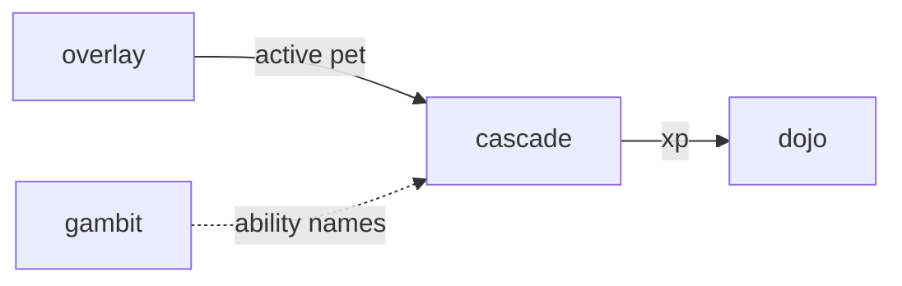

# Cascade

**Pet Puzzle Quest** — Match-3 battler that charges overlay pet abilities in real time.

Part of [ComputerPets](https://github.com/RicheyWorks/computerpets). Map: [computerpets-ecosystem](https://github.com/RicheyWorks/computerpets-ecosystem).

| | |
| --- | --- |
| Status | Design scaffold — loop and engine frozen |
| License | MIT |
| Tokens | Minigames never mint or burn. Tired overlay, not a dead lineage. |
| First pet | [Meet Rui first](https://github.com/RicheyWorks/computerpets/blob/main/docs/START-HERE.md). This game is optional. |

## The loop

Matches are not just score. Red cluster = Rui swipe. Blue = Reed hop. The pet on the side of the board is yours, vitals-aware.

## Who plays

Puzzle players. Colors map to the active pet kit.

## What it is not

A hidden pay-board. Colorblind palettes are required, not optional.

## Genre and engine

- Genre: **Match-3 RPG**
- Engine: **Phaser.js**
- Stack: TypeScript · Phaser 3 · match-3 board · real-time ability charge into a pet duel
- Default surface: `8080`

## Architecture



## How you play

1. Pick pet. Board colors map to its kit.
2. Match to fill bars, tap to fire.
3. Enemy is a training dummy or weekly boss.
4. Win = treat + XP into Dojo, not a new mint.

## First slice

Build this and stop.

**8x8 board, Rui swipe on red clusters, dummy enemy, XP into Dojo.**

You know it works when: Input debounce. Tab-out pauses vs dummy. Colorblind palette ships in v1.

## Environment

Node 22

## Failure doctrine

Mis-tap spam → input debounce. Tab-out pauses vs dummy, disconnect vs boss. Colorblind palettes required.

Canon rules that never yield:

- 210 living kinds. No illegal hybrids.
- Overlay pets can get tired, sick, or hide. Tokens are not burned by a minigame.
- Desktop walk stays the main quest. Closing Cascade must leave Rui walking.

## Neighbors

- computerpets (active pet)
- computerpets-quests
- computerpets-gambit (ability names)
- computerpets-telemetry

## Layout

```
computerpets-cascade/
  README.md
  LICENSE
  docs/DESIGN.md
  src/                implementation lands here
```

## Run (Windows)

```powershell
cd app; npm install; npm run dev
```

Meet Rui first via the [flagship start-here](https://github.com/RicheyWorks/computerpets/blob/main/docs/START-HERE.md). This game is optional.

## Links

- Flagship: [RicheyWorks/computerpets](https://github.com/RicheyWorks/computerpets)
- This repo: [RicheyWorks/computerpets-cascade](https://github.com/RicheyWorks/computerpets-cascade)
- Map: [RicheyWorks/computerpets-ecosystem](https://github.com/RicheyWorks/computerpets-ecosystem)
- Design file: [docs/DESIGN.md](docs/DESIGN.md)

## License

MIT. See [LICENSE](LICENSE).

---

*Two hundred ten living kinds. Keep them so a line does not go quiet.*
