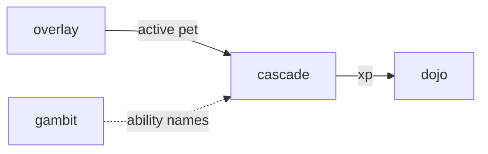

# Cascade

**Match colors. Charge your pet's abilities.**

A planned match-3 battler where board colors map to the active pet's kit, with accessible palettes and training encounters.

**Stage: design scaffold.** This checkout contains a design document and a source placeholder. The experience below is planned; there is no runnable app or integrated service yet.

[Status](#status) · [Planned experience](#planned-experience) · [Contributor quickstart](#contributor-quickstart) · [Game design](docs/DESIGN.md) · [Ecosystem map](https://github.com/RicheyWorks/computerpets-ecosystem)

## Status

| Available today | What you can inspect |
| --- | --- |
| [Game design](docs/DESIGN.md) | Intended behavior, boundaries, and planned dependencies. |
| [Source placeholder](src/index.ts) | Name metadata only; no package.json, app, or runtime is checked in. |
| [MIT license](LICENSE) | Licensing terms for the repository. |

Gameplay, endpoints, integration arrows, and failure handling on this page describe implementation targets. No build/test harness, CI workflow, or product screenshots are included in this scaffold.

## Planned experience

- Pick pet. Board colors map to its kit.
- Match to fill bars, tap to fire.
- Enemy is a training dummy or weekly boss.
- Win = treat + XP into Dojo, not a new mint.

### Planned technology

- Genre: **Match-3 RPG**
- Engine: **Phaser.js**
- Stack: TypeScript · Phaser 3 · match-3 board · real-time ability charge into a pet duel
- Default surface: `8080`

### Planned connections

These arrows show intended dependencies, rather than working integrations.



## Contributor quickstart

With access to this private repository, Git and PowerShell are enough to review the scaffold:

```powershell
git clone https://github.com/RicheyWorks/computerpets-cascade.git
Set-Location computerpets-cascade
Get-Content docs/DESIGN.md
Get-Content src/index.ts
```

Read [Game design](docs/DESIGN.md) before choosing implementation details. The commands above inspect the checked-in files; app installation, editor launch, and server startup become possible after a buildable project and entry point are added.

### First implementation target

**8x8 board, Rui swipe on red clusters, dummy enemy, XP into Dojo.**

You know it works when: Input debounce. Tab-out pauses vs dummy. Colorblind palette ships in v1.

Treat this as an acceptance target for a future implementation. Start with the documented slice, add the required project setup and focused tests, and update these instructions with commands that work from a fresh clone.

## Design boundaries

1. Minigames cannot mint or burn NFTs by themselves (Minter is the write path).
2. Stats come from lived overlay care + Dojo caps, not cash shop.
3. Species kits stay inside Lore. Illegal hybrids never spawn.
4. Fail soft: the desktop overlay process is not this process.

**Required failure behavior:**

Mis-tap spam → input debounce. Tab-out pauses vs dummy, disconnect vs boss. Colorblind palettes required.

## Ecosystem

- [computerpets](https://github.com/RicheyWorks/computerpets) (active pet)
- [computerpets-quests](https://github.com/RicheyWorks/computerpets-quests)
- [computerpets-gambit](https://github.com/RicheyWorks/computerpets-gambit) (ability names)
- [computerpets-telemetry](https://github.com/RicheyWorks/computerpets-telemetry)

Start with the [ComputerPets flagship](https://github.com/RicheyWorks/computerpets) for the desktop pet. This repository describes an optional extension; the [ecosystem map](https://github.com/RicheyWorks/computerpets-ecosystem) explains the broader plan.

## License

MIT. See [LICENSE](LICENSE).
